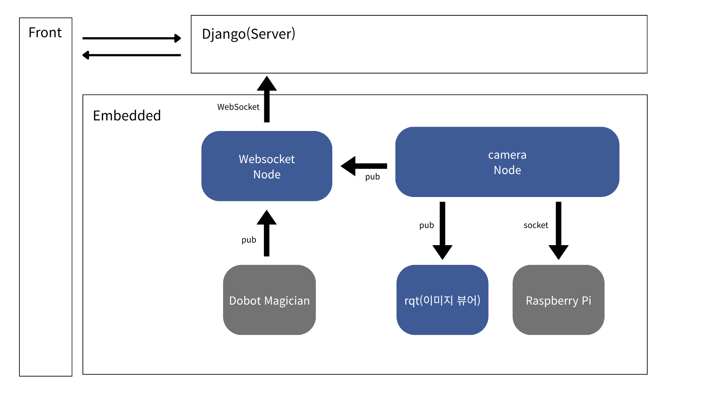

# 스마트 TV 제조 공정 모사 프로젝트

## 과제 개요
- 자동화된 스마트 TV 생산 라인을 모사한다.
- **pick and place** - Dobot을 활용해 부품을 컨베이어 벨트 위에 올려놓는다.
- **비전 인식+제어** - 부품이 벨트 위에 올라오면, 비전 인식으로 back panel과 board panel을 구분하여 sorter를 제어한다.
- ~~이후 공정은 RoboDK 가상 환경에서 구축하고 둘 사이를 연계한다.~~
- 로봇 상태를 웹 패널에 띄운다.

## 개발 환경
- **운영 체제**: Ubuntu 22.04 (서버), Raspberry Pi OS (컨베이어)
- **프로그래밍 언어**: Python 3.10
- **주요 하드웨어**:
  - Dobot Magician (로봇)
  - Intel RealSense D435i (카메라)
  - Raspberry Pi (컨베이어 제어)
- **주요 소프트웨어**:
  - Yolov5 (객체 탐지 모델)
  - ROS2 (로봇 제어 및 데이터 통신)
  - ~~RoboDK (시뮬레이션)~~
  - ~~Django (백엔드 서버)~~
  - ~~Vue.js (프론트엔드)~~

## 구조도

## 주요 구현 사항
### 1. Dobot Client
